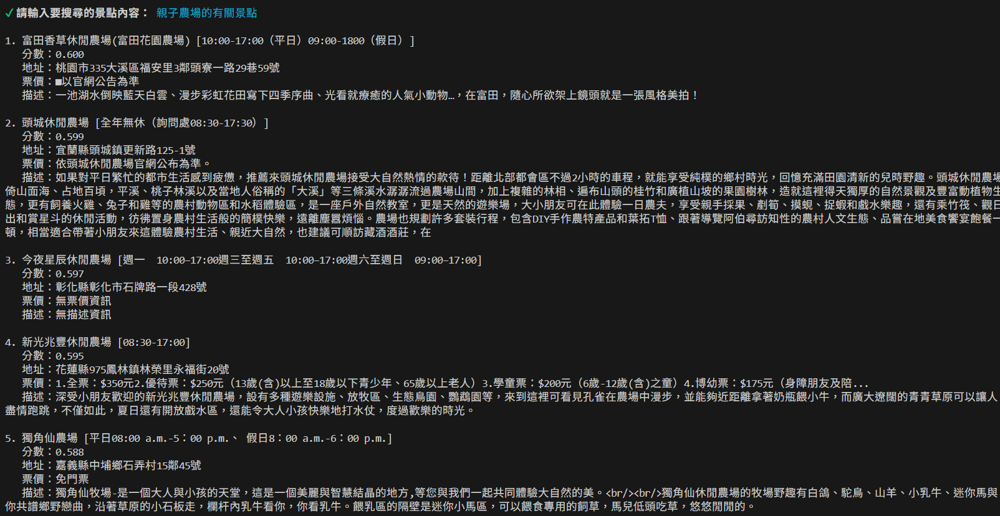
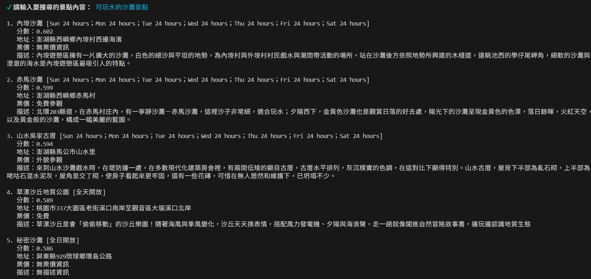
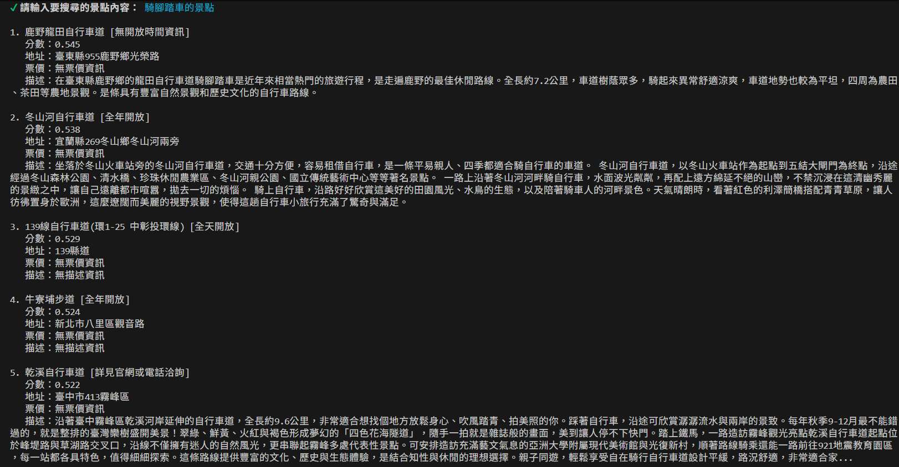

# Discover Taiwan — 台灣景點語意搜尋

以自然語言搜尋台灣景點的 CLI 工具。使用者輸入描述性的句子（例如「適合一個人的療癒景點」），系統透過向量相似度找出最相關的景點並列出詳細資訊。

## 架構

```
台灣景點 CSV 資料集
        ↓
  OpenAI Embeddings          (text-embedding-3-small, 1536 維)
        ↓
   Qdrant 向量資料庫         (Cosine 相似度)
        ↓
  CLI 互動介面 (main.js)     →  使用者輸入 → 嵌入查詢 → Top-5 結果
```

## 技術棧

| 元件 | 說明 |
|------|------|
| OpenAI `text-embedding-3-small` | 將景點文字與使用者查詢轉為向量 |
| Qdrant | 向量資料庫，儲存與搜尋嵌入向量 |
| Node.js + `@inquirer/prompts` | 互動式 CLI 介面 |

## 快速開始

```bash
# 1. 安裝相依套件
npm install

# 2. 設定環境變數
cp .env.example .env
# 填入 OPENAI_API_KEY、QDRANT_URL（及選填 QDRANT_API_KEY）

# 3. 將資料集嵌入至 Qdrant（首次執行）
node scripts/embed-scenic-spot.js

# 4. 啟動搜尋介面
node main.js
```

輸入 `exit` 離開程式。

## 搜尋結果範例

### 搜尋「親子農場的景點」



### 搜尋「可以玩水的沙灘」



### 搜尋「騎腳踏車的景點」


